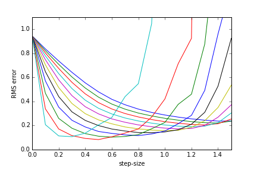
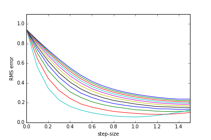
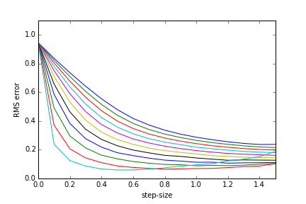
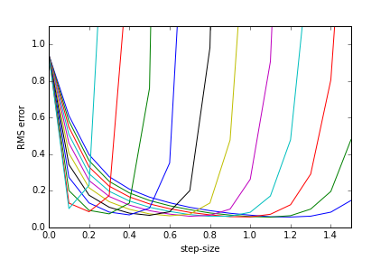
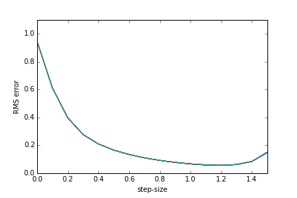
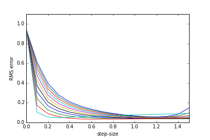

## Temporal-difference algorithms
A simple implementation in Python of classical TD algorithms, including TD, TD(λ) with accumulating traces and TD(λ) with replacing traces, and the recently proposed True Online TD(λ).
The algorithms are based on the paper of **van Seijen, H., Sutton, R. S. (2014). _True online TD(λ). In: Proceedings of the 31st International Conference on Machine Learning._** [[link]](http://jmlr.org/proceedings/papers/v32/seijen14.pdf)

### Experiments
The experiments reproduce the results of the original paper, which are obtained using a random walk environment with 11 states and two kinds of function approximatiors, namely, Task 1 and Task 2.
The following figures compare the performance (in terms of RMS error) of some TD methods for different step-sizes and λ values:
##### Task 1
###### TD(λ) accumulating traces

###### TD(λ) replacing traces

###### true online TD(λ)

##### Task 2
###### TD(λ) accumulating traces

###### TD(λ) replacing traces

###### true online TD(λ)

The experiments can be reproduced by running the corresponding file *experiment_[algorith_name].py*. It should take about a couple of minutes to run.
